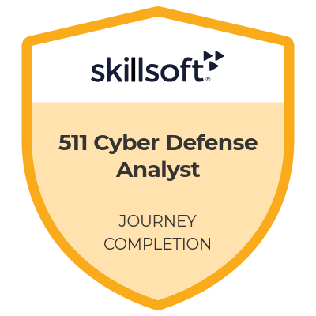
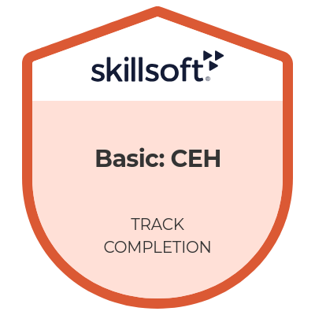

# Valentin Büttner - Vorstellung 📄

## Über mich
Ich bin ein engagierter Telekommunikationsinformatik-Student mit Schwerpunkt auf Netzwerksicherheit, Informationssicherheit und Datenbankmanagementsystemen. Mit praktischer Erfahrung in der Automatisierungstechnik und fundierten Kenntnissen in der Softwareentwicklung suche ich neue Herausforderungen im Bereich IT-Sicherheit.

---

## Fähigkeiten
- Agile Softwareentwicklung  
- MS Office Anwendungen  
- Software Design  
- Test Driven Development (TDD)
- Cybersecurity
- IT Security
- Ethical Hacking
- **Sprachen:**  
  - Deutsch (Muttersprache)  
  - Englisch (verhandlungssicher)  
  - Koreanisch (Grundkenntnisse)  

---

## Berufserfahrung

### **Sumitomo SHI Demag** (03.2018 - 08.2018)  
**Elektroniker für Automatisierungstechnik**  
- Wartung und Optimierung von Spritzgussmaschinen  
- Durchführung von Fehleranalysen und Implementierung von Lösungen  
- Zusammenarbeit mit technischen Teams zur Verbesserung von Prozessen  

### **Deutsche Telekom AG/Deutsche Telekom Technik GmbH** (10.2021 - Heute)  
**Dualer Student Telekommunikationsinformatik**  
- Erfolgreiche Umsetzung mehrerer Projekte:
  - Auftragnehmer-Managementsystem  
  - Shopfloor-Benachrichtigungssystem  
- Themen in Projektarbeiten:
  - Lean Management  
  - Barrierefreiheit im Web  
  - Unittests von Vue.js-Anwendungen  
- Erstellung bi-weekly Reports hinsichtlich Ressortergebnissen  
- Optimierung von Steuerungstools mittels VBA  
- **Schwerpunkte:**
  - Netzwerksicherheit  
  - Cybersecurity  
  - Practical Hacking  

---

## Ausbildung
- **09.2014 - 02.2018**  
  Geselle, Elektroniker für Automatisierungstechnik  

- **HTWK Leipzig** (10.2021 - Heute)  
  Bachelor of Engineering, Telekommunikationsinformatik  

---

Zertifikate & Leistungen 📜✨

Hier finden Sie eine Sammlung meiner beruflichen und akademischen Errungenschaften, die meinen Weg des lebenslangen Lernens dokumentieren. Jedes Zertifikat steht für erworbenes Wissen, Engagement und den Wunsch, mich kontinuierlich weiterzuentwickeln. 

## Verfügbare Zertifikate und Dokumente

- [Arbeitszeugnis/Zwischenzeugnis](Arbeitszeugnis_Zwischenzeugnis.pdf)
- [Zertifikate](Certificates)
- [Erledigte Projekte](Projekte)

## Erreichte Abzeichen und relevante Zertifikate
- [Certificates/Google Cybersecurity Certificate](Google Cybersecurity Certificate.pdf)
- [SIEM Splunk Hands-On Guide](SIEM Splunk Hands-On Guide.pdf)
- [Certified Ethical Hacker (v12)](Certified Ethical Hacking (v12).pdf)

  
  

- https://skillsoft.digitalbadges-eu.skillsoft.com/profile/eu-valentinbttner828344/wallet
